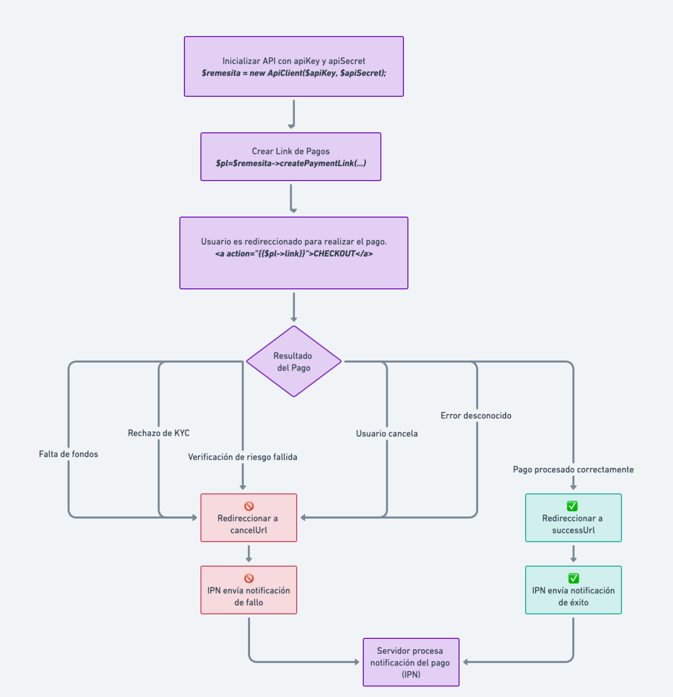

# API de Remesita

La clase `RemesitaAPI` proporciona una interfaz fácil de usar para interactuar con el servicio de Remesita. Esta clase cubre varias funcionalidades, incluyendo autenticación, obtención de negocios, transferencias entre cuentas, y más.

## Instalación

Asegúrate de tener instalado PHP y Composer en tu proyecto. Luego, puedes incluir la clase `ApiClient` en tu proyecto.

## Uso

### Inicialización

Para comenzar, necesitas inicializar la clase con tu `apiKey` y `apiSecret`:

```php
use Remesita\ApiClient;

$apiKey = "TU_API_KEY";
$apiSecret = "ApiClient";
$remesita = new ApiClient($apiKey, $apiSecret);
```

### Autenticación

La autenticación se maneja automáticamente dentro de la clase. Sin embargo, si deseas autenticarte manualmente, puedes hacerlo y ademas de obtener el token puedes obtener datos de usuario:

```php
$response = $remesita->authenticate();
$token = $response->accessToken;
$user = $response->user;
```

### Obtener Negocios

Para obtener una lista de negocios:

```php
/**
 * @var Remesita\DTO\Business[] $businesses
 */
$businesses = $remesita->getBusinesses();
```

### Transferencias entre cuentas

Para realizar una transferencia entre cuentas:

```php
/**
 * @var Remesita\DTO\TransferBetweenResponse $response
 */
$response = $remesita->transferBetweenAccounts("tarjta_origen", "tarjeta_destino", 100.50, "Transferencia de prueba");
```

### Cambiar estado de tarjeta

Para bloquear o desbloquear una tarjeta:

```php
$response = $remesita->toggleCardStatus("NUMERO_DE_TARJETA");
```


### Lista de negocios registrados

```php
/** 
 * @var Remesita\DTO\Business $b
 */
foreach($remesita->getBusinesses()  as $b){
    echo $b->id;
    echo $b->name;
    echo $b->logo;
    echo $b->description;
    echo $b->domain;
}
```


## Cobrando con Remesita Payment Link

Generar y usar un link de pagos involucrá:

- Inicialización de la API con apiKey y apiSecret.
- Autenticación y obtención del token.
- Creación del link de pagos usando el id de un Negocio registrado bajo tu cuenta.
- Proceso de pago por parte del usuario.
- Posibles razones de fallo y redirecciones a las URLs successUrl y cancelUrl.
- Proceso de IPN y cómo el servidor procesa las notificaciones.



*Este diagrama ahora refleja la inicialización de la API, la autenticación, la creación del link de pagos, el proceso de pago por parte del usuario, las posibles razones de fallo y las redirecciones a las URLs successUrl y cancelUrl. También se incluye el proceso de IPN y cómo el servidor procesa las notificaciones.*


### Implementación

```php
$myBusinessUnitId="a365366c-261f-11ed-9ef1-024206050103";
$concept= "Toma chocolate paga lo que debes";
$amount=101.99;

$methods= [
         # si methods es null se asumen todos los metodos de pago disponibles en la plataforma optimizado por la ubicacion del cliente
        "PREPAIDCARDBALANCE",
        "ZELLE",
        "SPEI",
        "BIZUM",
        "IBAN",
        "SEIS",
        "USDT",
        "BITCOIN",
        "PAYPAL"
];
$myExternalOrderCartId="MYID123"; //optional 
$payerName="YESAPIN GARCIA"; //optional
$payerPhone="+17863052277"; //optional
$payerEmail="yesapin@gmail.com"; //optional
$successUrl="https://miweb.com/checkout/success";
$cancelUrl="https://miweb.com/checkout/cancelled";
$ipnUrl="https://miweb.com/ipn?id=$myExternalOrderCartId";
/** 
 * @var Remesita\DTO\PaymentLinkResponse $pl
 */
$pl=$remesita->createPaymentLink(
    $myBusinessUnitId,
    $amount,
    $concept,
    $methods,
    $myExternalOrderCartId, //optional
    $ipnUrl, //optional
    $successUrl, //optional
    $cancelUrl, //optional
    $payerName, //optional
    $payerPhone, //optional
    $payerEmail //optional
);

echo $pl->link;
```

### Payload del IPN 
 ```json
{
    "app_id": "el business id",
    "status": "paid", #paid|completed|cancelled|payment_review|paused
    "paid_at": "2023-08-26 13:33:22",
    "liquid_at": "2023-08-26 17:34:56",
    "cancelled_at": null,
    "cancel_reason": "",
    "custom_id": "MYID123",
    "concept": "Toma chocolate paga lo que debes",
    "ref": "RM123456",
    "payment_method":  "PREPAIDCARDBALANCE" , #metodo de pago seleccionado por el pagador
    "amount": 101.99,
    "recipient_account": "TU TARJETA MAIN",
    "customer": {
        "code": "CODIGO DE CIENTE EN REMESITA",
        "name": "Yesapin Garcia",
        "phone": "+1786XXXXXXXX",
        "email": "yesapingueishon@gmail.com",
        "sex": "FEMALE",
        "iso": "US",
        "risk": 30,
        "profile_picture": "https://remesita.s3.amazonaws.com/uploads/profile-photo.jpeg",
        "kyc_verified": true
    }
}
```

### Lista de tarjetas

```php
/** 
 * @var Remesita\DTO\Card $c
 */
foreach($remesita->getCards()  as $c){
    echo $b->number;
    echo $b->balance; 
}
```

### Lista de transaccones de una tarjeta
```php
  
$from = new \DateTime("now - 30 days");
$to = new \DateTime("now");
$pg=1;
$pgSize=25;
$paggination=$remesita->getCardTransactions(
    $cardNumber,
    $from,
    $to,
    $pg,
    $pgSize
);

echo $paggination->total;
echo $paggination->pg;
echo $paggination->pgSize;
if($paggination->allowNext) {

}
/** 
 * $paggination implementa la interfaz \Iterator
 * @var Remesita\DTO\CardTransaction $c
 */
foreach($paggination  as $t){
    echo $t->amount;
    echo $t->type; //DBT or CRD
    echo $t->currency; 
    echo $t->date; 
    echo $t->memo; 
    echo $t->exchangeRate; //rate to USD
}
```


### Lista de ordenes
```php
  
$from = new \DateTime("now - 30 days");
$to = new \DateTime("now");
$pg=1;
$pgSize=25;
$paggination=$remesita->getOrders( 
    $from,
    $to,
    $pg,
    $pgSize
); 
/** 
 * $paggination implementa la interfaz \Iterator
 * @var Remesita\DTO\Order $o
 */
foreach($paggination  as $o){
    echo $o->reference; 
    echo $o->sku; 
    echo $o->recipientAmount; 
}
```


## Pruebas
Para ejecutar las pruebas, simplemente usa el comando:
```shel
phpunit ApiClientTest.php 
```


## Contribuciones

Las contribuciones son bienvenidas. Por favor, abre un issue si encuentras un bug o si tienes alguna sugerencia de mejora.

## Licencia

Este proyecto está bajo la licencia MIT.
